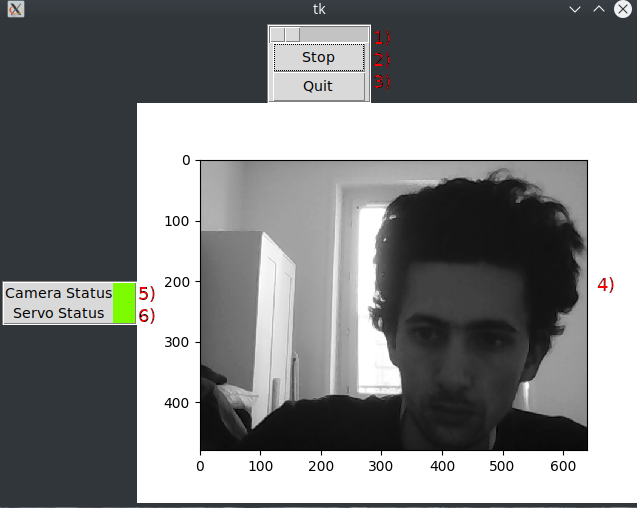

## Documentation pour le code client
***************************************
La capture d'image se passe sous la forme d'une vidéo/diaporama (de l'ordre de l'image par secondes)

1 -  Barre pour la position du servomoteur \
2 -  Bouton Capture/Stop permettant de lancer ou arreter la capture\
3 - Bouton pour quitter l'application\
4 - Fenêtre d'affichage de la vidéo/image, l'image est de 640*480 et en gris\
5 - Indicateur de la connexion entre la Caméra et le Client (Vert ok / Rouge caméra non connectée)\
6 -  Indicateur de la connexion entre le Servomoteur et le Client (Vert ok / Rouge servomoteur non connecté)